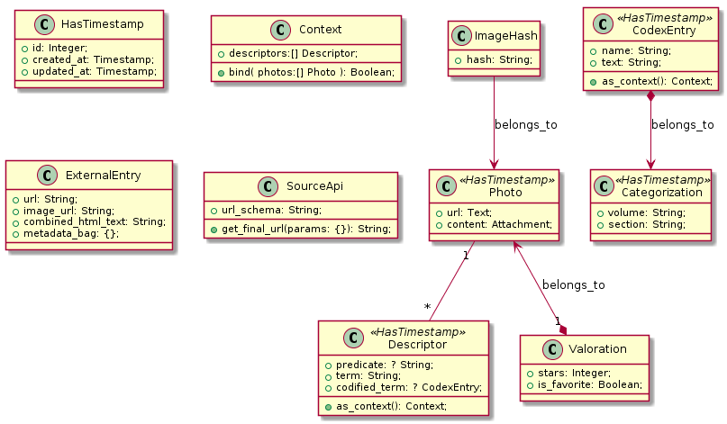
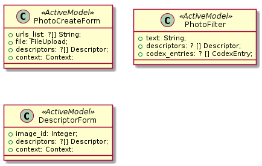

# imagedb
Imagedb

# Data model

[Dictionary](model-dictionary.md)

# Services

[Dictionary](services-dictionary.md)

# Controladores / Acciones

# Data transfer

 
# Sense making
[Journal (in spanish)](docs/journal/Main.md)
# Gems & components

* devise for auth
* devise_token_auth for API auth
* rubocop for static analysis
* rspec-rails for testing
* paperclip for attachments
* twitter-bootstrap-rails para estilos

